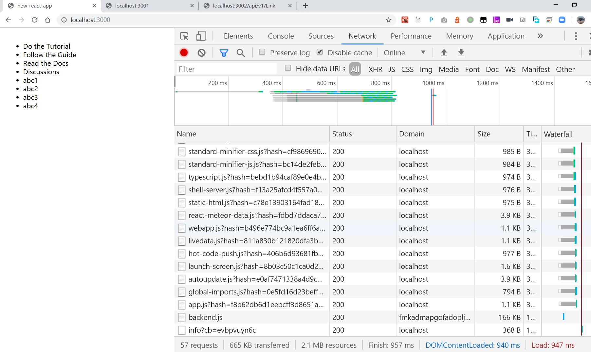
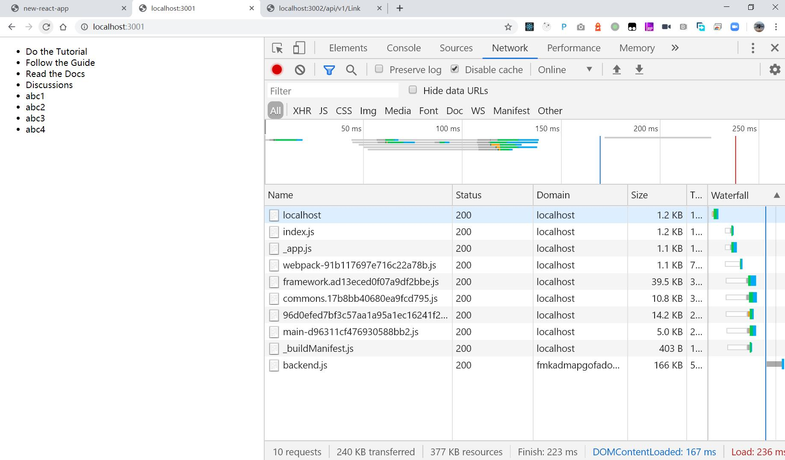

# meteor vs next

I believe next.js is the trend, this repo compare them in production config

- meteor without autopublish
- next build and start, with rest backend

## result 

### page speed

- meteor



- next



next is 1/4 of meteor same data simple page

### main other diffs

- next support SSR, meteor not

SSR is good for SEO, and better UE for low speed network

- meteor support realtime update (less convient without autopublish), next not

next need extra logic, but you can choose SSE rather than WS used by meteor, and realtime update is not needed for most cases in my experience

## try on your own

```
cd meteor
meteor npm i
meteor
```
then meteor is on http://localhost:3000/

```
cd rest
npm i
node app.js
```
then rest api is on http://localhost:3002/

```
cd next
npm run build
npm run start
```
then next is on http://localhost:3001/